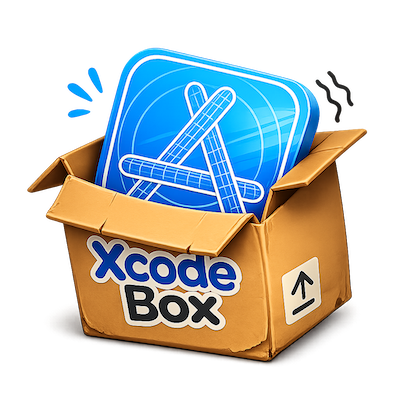

<p align="center">
  
</p>

<h1 align="center">xcbox</h1>

<p align="center">
  <b>Run a coding agent in a sandbox scoped to your Xcode/Swift project.</b><br>
  The agent sees only your repo — yet it builds, tests, and runs on the host, and commits as you.
</p>

---

`xcbox` drops a coding agent (e.g. [Claude Code](https://www.claude.com/product/claude-code))
into a Linux container with **only your project's git repository** mounted — nothing else of your
machine is visible. The agent still builds and tests the real app **on the host** via
[XcodeBuildMCP](https://github.com/cameroncooke/XcodeBuildMCP), and commits & pushes with **your
git identity over your forwarded SSH agent** — your keys never enter the container.

## Why xcbox

Let the agent run amok — build, test, commit — without babysitting. The safe way is a Linux
sandbox scoped to your repo, so a mistake stays contained there and never reaches the rest of your host.

The catch: **Xcode doesn't run on Linux.** `xcodebuild`, the simulators, the SDKs are all
macOS-only, so a plain container can't compile an iOS or macOS app.

xcbox squares that circle: the agent stays sandboxed in Linux and sees **only your repo**, while
real builds are delegated to the host over a gateway — blast-radius protection *and* full-fidelity
Apple builds.

## Highlights

- **One command.** Run `xcbox` from an Xcode/Swift project or a repo containing one.
- **Project-scoped sandbox.** The agent's filesystem is limited to your repo; the rest of the host stays invisible.
- **Real host builds.** `xcodebuild` and simulators run on macOS through XcodeBuildMCP — full fidelity, no toolchain shipped in the container.
- **Commits as you.** Uses your host git identity and forwarded SSH agent; private keys stay on the host.
- **Every Apple platform**, plus Swift packages — because XcodeBuildMCP drives them all.

## Install

Put `xcbox` on your `PATH` (symlinks `bin/xcbox` into a bin dir already on your `PATH`):

```bash
git clone git@github.com:Bunn/xcbox.git && cd xcbox
./install.sh                 # auto-picks a writable dir on PATH
```

`./install.sh /usr/local/bin` installs into a specific dir; `./install.sh --uninstall` removes it.
The symlink resolves back to the repo, so `git pull` updates the installed command. Prefer not to
install? Just run `bin/xcbox` directly.

## Quickstart

```bash
cd ~/YourApp
xcbox                        # brings up the sandbox and drops you into a shell
```

Inside the box, start your agent and point it at the project:

```
claude
/login                       # only if prompted; persists in this project's home
> Build and test this app, then commit and push.
```

Run `xcbox doctor` first if you want to check prerequisites. Full walkthrough:
[`docs/xcbox-quickstart.md`](docs/xcbox-quickstart.md).

## How it works

```
HOST (macOS)                                CONTAINER (Linux · repo-only)
  XcodeBuildMCP behind a stateful             your agent (e.g. Claude Code)
  loopback gateway on :8765  ◄────────────────  host.container.internal:8765
  Xcode toolchain (xcodebuild / simctl)       sees ONLY your git repo + its own home
  isolated per-project agent home             login is seeded; mutable state stays separate
  your git identity + forwarded SSH agent     commits as you; keys stay on the host
```

`xcbox` resolves the nearest Xcode/Swift project, or a unique nested project when run from the
repository root. It mounts the **git repository root** (so `.git` is present and commit/push work
even when the Xcode project lives in a subdirectory) and drops you into the resolved project
directory. The build server is registered with the agent at user scope; the agent calls real
`xcodebuild` on the host and the results stream back over the gateway.

## Requirements

Apple Silicon · macOS 26+ · Xcode 26+ · Node.js 20+ · Apple [`container`](https://github.com/apple/container)
CLI · a global git identity · an SSH agent with a key loaded · Apple container's localhost DNS bridge.

```bash
sudo container system dns create host.container.internal --localhost 203.0.113.113
xcbox doctor                 # checks all of the above, including the bridge
```

The DNS bridge lets boxes reach a host service bound only to `127.0.0.1`. Apple container may
remove the rule after a restart; `xcbox doctor` and `xcbox up` report the command to recreate it.
On first use, `xcbox up` installs the exact MCP SDK and XcodeBuildMCP versions recorded in
`package-lock.json`. The HTTP bridge is part of xcbox itself; later starts use the locked local runtime
and do not contact npm unless the lock changes.

## Commands

| Command | Description |
| --- | --- |
| `xcbox` · `xcbox up` | bring up the gateway + repo sandbox and enter it |
| `xcbox status` | verify host + box gateway, real MCP, agent, and forwarded SSH state |
| `xcbox stop` | stop this project's box (`--gateway` also stops the gateway) |
| `xcbox logs` | tail the build gateway log |
| `xcbox rm` | remove this project's box (keeps `~/.xcbox-home`) |
| `xcbox doctor` | check host prerequisites |

Each box gets an independent home under `~/.xcbox-home/boxes/<box-name>`. Its login, installed agent,
Claude sessions, npm cache, and Git configuration persist across runs without being writable by
other boxes. A new home copies the freshest existing Claude login and user preferences once; it does
not copy project history or caches. `xcbox rm` removes the container but retains that home.

Boxes created by an older version may still mount all of `~/.xcbox-home` as `/root`. xcbox refuses
to start those with shared state and asks you to stop/remove/recreate the container; the old home is
left untouched and used only to seed login/preferences into the replacement.

For a running box, `xcbox status` checks the complete operational path: an in-container gateway
health request, a bounded stateful MCP `tools/list` session, and `ssh-add -l` through the forwarded
socket. Failures include the relevant restart, DNS bridge, log, SSH-agent, or box-recreation command.

## FAQ

### Can I have multiple xcboxes running in parallel?

Yes. Each project gets a box named from a readable directory slug plus a short hash of its canonical
full path, such as `xcbox-myapp-a1b2c3d4`. Different projects with the same folder name therefore
remain independent, while opening the same project through a symlink reuses its box. All boxes share
the **single** build gateway on `:8765`, which multiplexes their `xcodebuild` calls.

If a repository contains multiple Xcode projects, run xcbox inside the intended project directory
or select it explicitly, for example `PROJECT=apps/MyApp xcbox`. xcbox lists the candidates instead
of choosing one arbitrarily.

Boxes created by older xcbox versions used only the directory basename. When one is found, xcbox
refuses to guess its ownership and prints explicit inspect/remove/recreate instructions; it never
stops or removes that legacy box automatically.

### Can I use any agent I want, like OpenCode, Codex, etc.?

The box itself is agent-agnostic — it's a plain Linux (`node:22`) shell with the build gateway
reachable at `http://host.container.internal:8765/mcp`, so you can install and run whatever agent you like
inside it.

What's automated, though, is Claude Code specific: xcbox installs `@anthropic-ai/claude-code` by
default and auto-registers the build server via `claude mcp add`. You can swap the installed package
with `XCBOX_AGENT_INSTALL=<npm-package>`, but for a non-Claude agent you'll need to point it at the
gateway MCP endpoint yourself — xcbox won't wire that up for you.

### Is my host machine 100% protected?

**No.** xcbox is a *blast-radius* tool, not a security boundary against a malicious agent. It limits
what the agent can **see** (only your repo), but builds still execute your project's real build
scripts on the host via `xcodebuild`, the container keeps network access, and the gateway on
`:8765` has **no authentication**. The gateway is loopback-only, but any local process or container
using the configured localhost bridge can reach it. Treat xcbox as protection against mistakes,
not against hostile code. See [Security model](#security-model) for the full picture.

### Do my SSH keys or credentials end up in the container?

No. Only the SSH **agent socket** is forwarded (`--ssh`), so the box can sign pushes as you without
your private keys ever leaving the host. Your git identity (name/email) is copied in so commits are
attributed correctly.

### What happens to the box when I `exit`?

Nothing — it keeps running in the background so the next `xcbox` is instant. Use `xcbox stop` to
stop it, `xcbox stop --gateway` to also stop the shared gateway, or `xcbox rm` to delete the box
(your agent login in `~/.xcbox-home` survives either way).

### Why does it mount my whole repo instead of just the Xcode project folder?

So `.git` comes along and the agent can commit and push — even when the `.xcodeproj` lives in a
subdirectory of the repo. You still start in your project directory inside the box.

## Tests

Standalone bash scripts, run directly:

```bash
bin/test-ci.sh            # syntax + ShellCheck + all Linux-safe tests (also runs in GitHub Actions)
bin/test-guard.sh
bin/test-lib.sh
bin/test-project-identity.sh
bin/test-box-home.sh
bin/test-status-probes.sh
bin/test-dispatch.sh
bin/test-doctor.sh
bin/test-subcommands.sh
bin/test-runtime.sh          # locked install detection + offline reuse + lock refresh
bin/test-gateway.sh          # starts the gateway; verifies a real MCP session
bin/test-gateway-lifecycle.sh # isolated start → stop → restart lifecycle regression
bin/test-loop.sh             # full end-to-end: generate a throwaway app → build + test through the sandbox
```

GitHub Actions runs `bin/test-ci.sh` on every push and pull request using a read-only token. The
Apple container/Xcode gateway and full iOS build/test loop remain local macOS checks.

## Updating the gateway runtime

Gateway dependencies move only through an explicit lockfile update—never through `@latest` at startup:

```bash
npm install --save-exact @modelcontextprotocol/sdk@VERSION xcodebuildmcp@VERSION
bin/test-runtime.sh
bin/test-gateway-lifecycle.sh
bin/test-gateway.sh
```

Review and commit `package.json` and `package-lock.json` together. The next `xcbox up` detects the new
lockfile hash and runs `npm ci`; unchanged installations continue using their existing local binaries.

## Security model

**Trusted-agent.** The sandbox isolates the agent's *filesystem* to your repository — it guards
against mistakes and blast radius, not a malicious agent. Builds still run your project's build
scripts on the host via `xcodebuild`, and the container keeps network access (it must reach the
gateway). The unauthenticated gateway binds only to host loopback and boxes reach it through Apple
container's localhost DNS bridge. Other local processes and containers using that bridge can still
reach it, so xcbox remains a trusted-agent tool rather than a boundary against hostile code.
